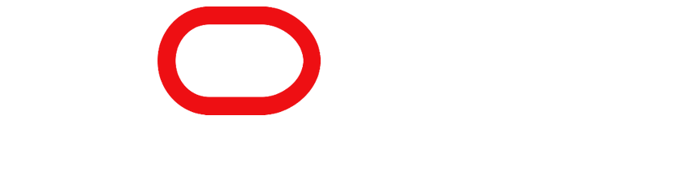

<h1 align="center"> Challenge ONE - Turma 06</h1>

    <a href="#sobre">Sobre</a> |
    <a href="#requisitos">Requisitos</a> |
    <a href="#resultado-final">Resultado Final</a> |
    <a href="#referencias">Referências</a>
    

O programa ONE - Oracle next education é um programa da Oracle em parceria com alura, de educação e empregabilidade com objetivo social de capacitar pessoas em tecnologia e conectá-las com o mercado de trabalho por meio de empresas parceiras.

<h2>SITE:https://j4niks.github.io/ChallengeOne-decodificador/</h2>

### Sobre
> Meu nome é janiks tenho 21 anos, desenvolvi esse projeto para o challenge do programa ONE.

> O challenge ONE Sprint 01: consiste na criação de um site para decodificação de texto usando as tecnologias: 
> - JavaScript
> - CSS
> - HTML

### Requisitos
> - Deve funcionar apenas com letras minúsculas.
> -  Não devem ser utilizados letras com acentos nem caracteres especiais.
> - Deve ser possível converter uma palavra para a versão criptografada e também retornar uma palavra criptografada para a versão original.
> - Um botão que copie o texto criptografado/descriptografado para a área de transferência - ou seja, que tenha a mesma funcionalidade do ctrl+C ou da opção "copiar" do menu dos aplicativos.

> Uma lista de palavras a serem usadas como criptografia foi passada, mas decidi que usaria minhas próprias que consiste do alfabeto fonetico com as palavras invertidas:

> - a: uluz
> - b: eeknay
> - c: yarx
> - d: yeksihw
> - e: rotciv
> - f: mrofinu
> - g: ognat
> - h: arreis
> - i: oemor
> - j: cebeuq
> - k: apap
> - l: racso
> - m: rebmevon
> - n: ekim
> - o: amil
> - p: olik
> - q: teiluj
> - r: aidni
> - s: letoh
> - t: flog
> - u: tortxof
> - v: ohce
> - w: atled
> - x: eilrahc
> - y: ovarb
> - z: afla

> Design base proposto do desafio:

### Resultado final

> - Tema claro

> - Tema Escuro

### Referencias
> Mais alguns sites foram usados mas esses são os que consigo lembrar. 😜
- https://medium.com/david-fernando/como-dark-theme-com-javascript-puro-fc277377447c
- https://blog.logrocket.com/localstorage-javascript-complete-guide/
- https://developer.mozilla.org/en-US/docs/Web/JavaScript/Reference/Global_Objects/RegExp
- https://www.regular-expressions.info/charclass.html

